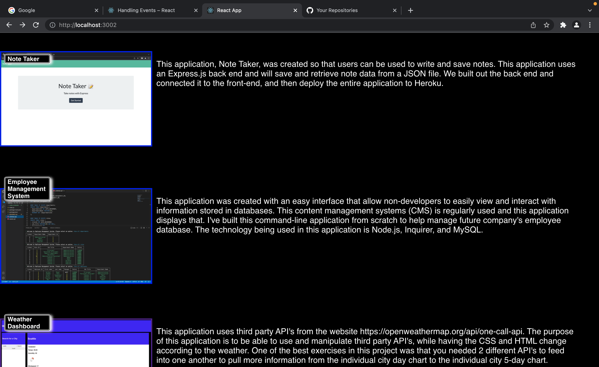
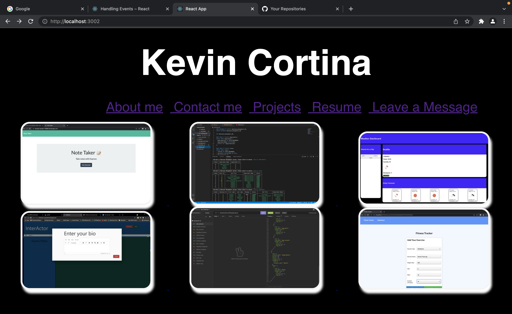

  

  # React Portfolio
  
  ## Description
  This is my portfolio made in react. I have attached 6 projects to this portfolio along with a contact me section and updated social medias at the bottom. 
  

  ## Deployed Application
  https://kevin-cortina.github.io/ract-port-2/  

  ## Screenshot of application
   
   
  
  ## Table of Contents
  - [Installation](#installation)
  - [Usage](#usage)
  - [Contributing](#contributing)
  - [License](#license)
  - [Badges](#badges)
  - [Features](#features)
  - [Tests](#test)
  - [Questions](#questions)
 
  ## Installation
  Feel free to install. When you download make sure to `NPM I` to get all the dependencies needed to view. Then `NPM START` to view it locally.

  ## Contributing
  Feel free to add or change any code.

  
  ## License
  Community
  

  ## Features
  This application solely uses React on the front-end without any back end to it. The purpose of this is to show my ability on how to use react/design react and to showcase some project i've done over the past 6 months.
  
  ## Tests
  N/A
 
  
  ## Questions
  If you have any questions feel free to contact me via email kevinc.php@gmail.com, Github kevin-cortina.
  